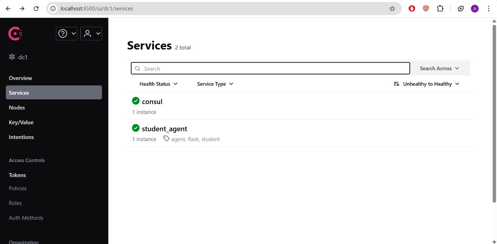

# Student Agent – Flask Student Profile Manager

A web application for managing student profiles, skills, projects, and education, built with Flask and SQLite and deployed via Docker on Railway.

## Features

- **Student Dashboard:** Visualize and manage student records  
- **CRUD API:** Create, Read, Update, Delete student profiles  
- **Skills & Projects Browsing:** List top skills, filter projects by skill  
- **Seed Data:** Default student data loaded on first launch  
- **Easy Deployment:** Containerized with Docker and deploys on Railway

## Tech Stack

- **Backend:** Python (Flask, flask-cors, requests)  
- **Database:** SQLite  
- **Frontend:** HTML templates (Jinja2)  
- **DevOps:** Docker, Railway , Hashicorp consul

## Setup & Installation

### Prerequisites

- Python 3.8 or higher  
- Docker installed (for local container builds)  
- A Railway account
- HashiCorp Consul:** Used for service discovery and configuration (optional but recommended for production environments)
  
### Installing Consul
1. Download the latest Consul binary from the [official releases](https://releases.hashicorp.com/consul/).  
2. Unzip and move the binary to your system path (e.g., `/usr/local/bin`).  
3. Create a system user for Consul for security:
4. 

### Local Development

- git clone https://github.com/ashupats2005/student_agent.git
- pip install -r requirements.txt
- cd student_agent
- docker-compose build student_agent
- docker-compose up

## Deployment

The Student Agent Flask application is deployed and publicly accessible at:

**(https://studentagent-production.up.railway.app/)**

You can open this URL in any web browser to interact with the live student profile management system. The application features a web dashboard for viewing and managing student data, along with RESTful API endpoints for programmatic access.

This deployment is hosted on Railway and leverages Docker containers to simplify scalability and infrastructure management.

## API Endpoints

| Route                      | Method | Description                   |
|----------------------------|--------|-------------------------------|
| `/`                        | GET    | Main dashboard/homepage       |
| `/central_app`             | GET    | Student dashboard             |
| `/student/create`          | POST   | Create a new student profile  |
| `/student/<student_id>`    | GET    | Get details of a student      |
| `/student/<student_id>`    | PUT    | Update a profile              |
| `/student/<student_id>`    | DELETE | Delete a profile              |
| `/student/all`             | GET    | List all profiles             |
| `/projects`                | GET    | Filter projects by skill      |
| `/skills/top`              | GET    | Show top skills               |
| `/search`                  | GET    | Search profiles               |
| `/health`                  | GET    | Health check/test             |

## Seed Data

Initial student profiles, skills, and project data are loaded from `seed.sql` and displayed via the UI for demo/testing purposes.

